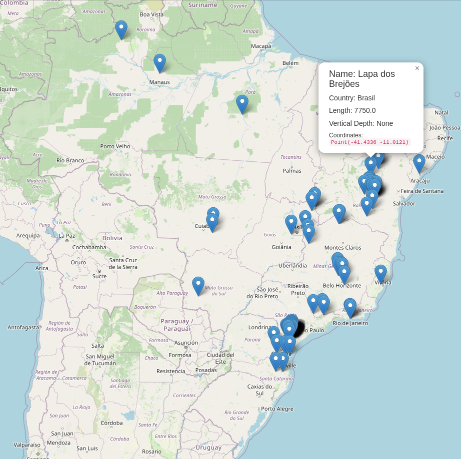
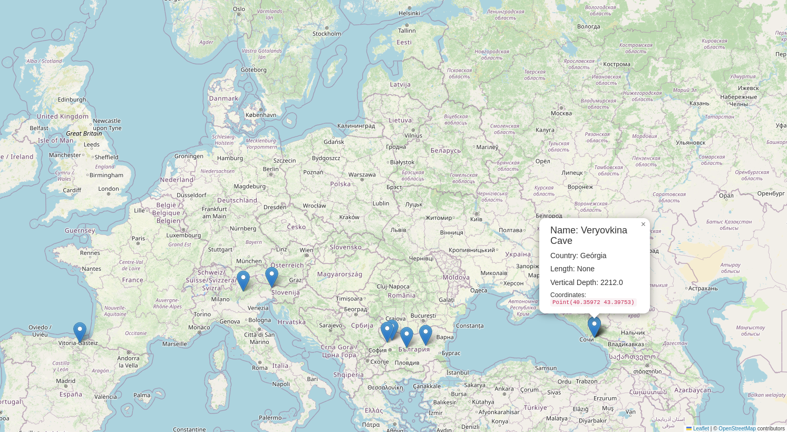

# Exploração de Cavernas

## Use para extrair os dados mais atuais em: Wikidata Query Service
```sql
SELECT DISTINCT ?itemLabel ?coordinate_location ?countryLabel ?temperature ?vertical_depth ?elevation_above_sea_level ?length WHERE {
  ?item (wdt:P31/wdt:P279*) wd:Q35509.
  ?item wdt:P625 ?coordinate_location.
  OPTIONAL { ?item wdt:P17 ?country. }
  OPTIONAL { ?item wdt:P2076 ?temperature. }
  OPTIONAL { ?item wdt:P4511 ?vertical_depth. }
  OPTIONAL { ?item wdt:P2044 ?elevation_above_sea_level. }
  OPTIONAL { ?item wdt:P2043 ?length. }
  MINUS { ?item wdt:P576 _:b1. }
  SERVICE wikibase:label { bd:serviceParam wikibase:language "[AUTO_LANGUAGE], en". }
}
ORDER BY ?itemLabel
```
## Cavernas no Brasil


## Cavernas mais profundas

